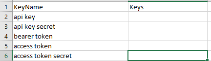

# Sales Insights Using PowerBI

Simple sentiment analysis on tweets of a hastag using twitter API.

## 🛠Tools and libraries used
1) Tweepy
2) Textblob
3) Wordcloud
4) Pandas
5) Numpy
6) Regex 
7) Matplotlib
8) Seaborn
9) Jupyter Notebook
## Note
Create a csv file for API keys in following format as keys.csv and paste it inside the folder.

# Hi, I'm Zeeshan! 👋

## 🚀 About Me
I'm a Data Scientist and Data Analyst...

